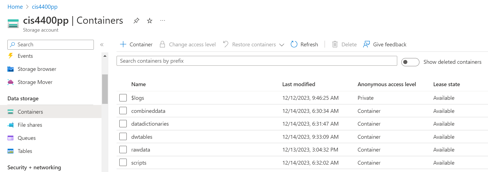
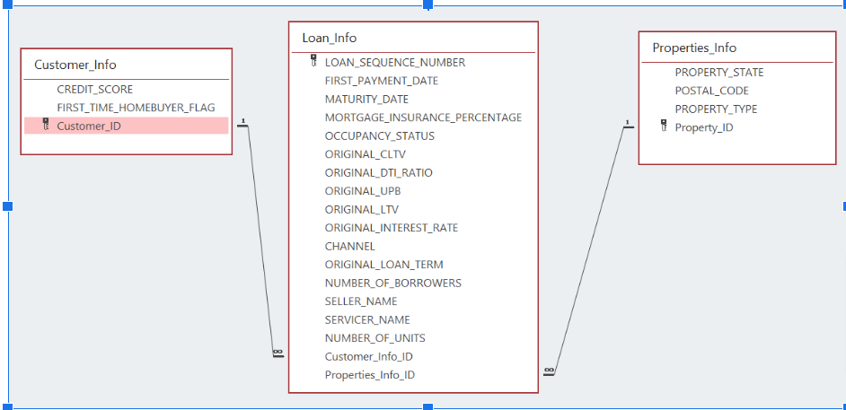

# Freddie Mac Personal Project
---
Business Problem
---
We, Cheng Mortgage Services, want to improve how we handle home loans. We're facing more customers having trouble repaying their mortgages. To tackle this, we need to make sense of a big dataset from Freddie Mac. But it's tricky because the data is huge and complicated. Cheng Mortgage Services needs a solution to quickly figure out which loans are risky, predict if someone might not be able to pay, and take steps to avoid losing money

---
Data Sourcing
---
We first acquired the data sets from Freddie Mac's official website, https://www.freddiemac.com/research/datasets/sf-loanlevel-dataset. We specifically picked Loan-Level Dataset Files which are Standard and Annual. Then we chose the sample data sets for the years 2020, 2021, and 2022 from the Originating Files. The sample dataset is a simple random sample of 50,000 loans selected from each full vintage year and a proportionate number of loans from each partial vintage year of the Standard Dataset. Included in the file is the User Guide of this data set, which serves as our Data Dictionary. You can access it in Github or through this link:

Data Dictionary: https://cis4400pp.blob.core.windows.net/datadictionaries/data_dictionary.pdf

The links for the Raw Data Sets in .txt format are attached below: 

sample origination data for the Year 2020: https://cis4400pp.blob.core.windows.net/rawdata/sample_orig_2020.txt

sample origination data for the Year 2021: https://cis4400pp.blob.core.windows.net/rawdata/sample_orig_2021.txt

sample origination data for the Year 2022: https://cis4400pp.blob.core.windows.net/rawdata/sample_orig_2022.txt

Below are the Python scripts that downloaded the .txt files which were uploaded to Microsoft Azure Blob Storage, merged them into one Excel file for better viewing and analyzing, and uploaded it back to Azure Blob Storage. 

```python
pip install pandas openpyxl azure-storage-blob
import pandas as pd
from io import StringIO
import os
from azure.storage.blob import BlobServiceClient, BlobClient, ContainerClient

# Connect to Azure Storage Account
connection_string = "DefaultEndpointsProtocol=https;AccountName=cis4400pp;AccountKey=v5P+piRvmQQjp+PYMyBTR6oV8JSjJIYxUZCpEnDrTdsKqduDPFGOAhN/vLo2r8H3ye873+A2IG7K+AStmNDHsQ==;EndpointSuffix=core.windows.net"
blob_service_client = BlobServiceClient.from_connection_string(connection_string)

# Container and Blob Names
container_name = "rawdata"
output_blob_name = "combined_data.xlsx"

# Define constants
input_folder = 'C:/Users/User/Desktop/School/Baruch Stuffs/FALL 2023/CIS 4400/raw_data'
output_excel_path = 'C:/Users/User/Desktop/School/Baruch Stuffs/FALL 2023/CIS 4400/combined_data/combined_data.xlsx'

common_headers = ['CREDIT_SCORE',
                  'FIRST_PAYMENT_DATE',
                  'FIRST_TIME_HOMEBUYER_FLAG',
                  'MATURITY_DATE',
                  'MSA',
                  'MORTGAGE_INSURANCE_PERCENTAGE',
                  'NUMBER_OF_UNITS',
                  'OCCUPANCY_STATUS',
                  'ORIGINAL_CLTV',
                  'ORIGINAL_DTI_RATIO',
                  'ORIGINAL_UPB',
                  'ORIGINAL_LTV',
                  'ORIGINAL_INTEREST_RATE',
                  'CHANNEL',
                  'PPM_FLAG',
                  'AMORTIZATION_TYPE',
                  'PROPERTY_STATE',
                  'PROPERTY_TYPE',
                  'POSTAL_CODE',
                  'LOAN_SEQUENCE_NUMBER',
                  'LOAN_PURPOSE',
                  'ORIGINAL_LOAN_TERM',
                  'NUMBER_OF_BORROWERS',
                  'SELLER_NAME',
                  'SERVICER_NAME',
                  'SUPER_CONFORMING_FLAG',
                  'PRE-RELIEF_REFINANCE_LOAN_SEQUENCE_NUMBER',
                  'PROGRAM_INDICATOR',
                  'RELIEF_REFINANCE_INDICATOR',
                  'PROPERTY_VALUATION_METHOD',
                  'INTEREST_ONLY_INDICATOR',
                  'MI_CANCELLATION_INDICATOR']

# Initialize an empty DataFrame
combined_data = pd.DataFrame()

# Iterate through text files
for filename in os.listdir(input_folder):
    if filename.endswith(".txt"):
        file_path = os.path.join(input_folder, filename)

        # Read the text content into a DataFrame
        df = pd.read_csv(file_path, sep='|', header=None)
        
        # Add headers to the DataFrame
        df.columns = common_headers

        # Cleanse and preprocess the data as needed
        df = df.drop_duplicates()

        # Fill in 0 for empty values
        df = df.fillna(0)
        
        # Append the data to the combined DataFrame
        combined_data = combined_data.append(df, ignore_index=True)

# Convert the combined DataFrame to Excel format
combined_data.to_excel(output_excel_path, index=False, engine='openpyxl') 

# Upload the Excel file back to Blob Storage
with open(output_excel_path, "rb") as data:
    blob_client = blob_service_client.get_blob_client(container=container_name, blob=output_blob_name)
    blob_client.upload_blob(data, overwrite=True)
```
This is the Combined Excel File uploaded to Microsoft Azure Storage Blob:

combined_data.xlsx : https://cis4400pp.blob.core.windows.net/combineddata/combined_data.xlsx

Below are the Python scripts that downloaded the .txt files which were uploaded to Microsoft Azure Blob Storage, merged them into one CSV file for better viewing and analyzing, and uploaded it back to Azure Blob Storage.
```python
pip install pandas azure-storage-blob
from azure.storage.blob import BlobServiceClient
import pandas as pd
import os

account_name = 'cis4400pp'
account_key = 'v5P+piRvmQQjp+PYMyBTR6oV8JSjJIYxUZCpEnDrTdsKqduDPFGOAhN/vLo2r8H3ye873+A2IG7K+AStmNDHsQ=='
container_name = 'rawdata'
new_container_name = 'combineddata'
local_pathway = 'C:/Users/User/Desktop/School/Baruch Stuffs/FALL 2023/CIS 4400/downloaded_raw_data/'

blob_service_client = BlobServiceClient(account_url=f"https://{account_name}.blob.core.windows.net", credential=account_key)
container_client = blob_service_client.get_container_client(container_name)

# List all CSV files in the container
blob_list = container_client.list_blobs()

for blob in blob_list:
    # Check if the file has a ".txt" extension
    if blob.name.endswith('.txt'):
        blob_client = container_client.get_blob_client(blob.name)
        blob_data = blob_client.download_blob()
        local_file_path = os.path.join(local_pathway, blob.name.split("/")[-1])
        with open(local_file_path, 'wb') as local_file:
            local_file.write(blob_data.readall())
        print(f"Downloaded: {blob.name} to {local_file_path}")
        
# List local TXT files
local_txt_files = [f for f in os.listdir(local_pathway) if f.endswith('.txt')]

# Read local TXT files into DataFrames
local_txt_dataframes = [pd.read_csv(os.path.join(local_pathway, file), header=None, sep='|') for file in local_txt_files]

# Merge DataFrames vertically and drop duplicates
combined_df = pd.concat(local_txt_dataframes, ignore_index=True).drop_duplicates()

# Fill zeros for empty values
combined_df = combined_df.fillna(0)

combined_df.columns = ['CREDIT_SCORE',
                          'FIRST_PAYMENT_DATE',
                          'FIRST_TIME_HOMEBUYER_FLAG',
                          'MATURITY_DATE',
                          'MSA',
                          'MORTGAGE_INSURANCE_PERCENTAGE',
                          'NUMBER_OF_UNITS',
                          'OCCUPANCY_STATUS',
                          'ORIGINAL_CLTV',
                          'ORIGINAL_DTI_RATIO',
                          'ORIGINAL_UPB',
                          'ORIGINAL_LTV',
                          'ORIGINAL_INTEREST_RATE',
                          'CHANNEL',
                          'PPM_FLAG',
                          'AMORTIZATION_TYPE',
                          'PROPERTY_STATE',
                          'PROPERTY_TYPE',
                          'POSTAL_CODE',
                          'LOAN_SEQUENCE_NUMBER',
                          'LOAN_PURPOSE',
                          'ORIGINAL_LOAN_TERM',
                          'NUMBER_OF_BORROWERS',
                          'SELLER_NAME',
                          'SERVICER_NAME',
                          'SUPER_CONFORMING_FLAG',
                          'PRE-RELIEF_REFINANCE_LOAN_SEQUENCE_NUMBER',
                          'PROGRAM_INDICATOR',
                          'RELIEF_REFINANCE_INDICATOR',
                          'PROPERTY_VALUATION_METHOD',
                          'INTEREST_ONLY_INDICATOR',
                          'MI_CANCELLATION_INDICATOR']

# Convert to CSV format
combined_csv_output = os.path.join(local_pathway, 'combined_data.csv')
combined_df.to_csv(combined_csv_output, index=False)

# Upload the combined CSV file to the different existing container
new_container_client = blob_service_client.get_container_client(new_container_name)
new_blob_client = new_container_client.get_blob_client('combined_data.csv')

with open(combined_csv_output, 'rb') as data:
    new_blob_client.upload_blob(data, overwrite=True)
    print(f"Uploaded: combined_data.csv to {new_container_name}")
```
This is the Combined CSV File uploaded to Microsoft Azure Storage Blob:

combined_data.csv : https://cis4400pp.blob.core.windows.net/combineddata/combined_data.csv

---
Data Storage
---
We utilized Microsoft Azure Blob Storage as our data storage option to provide a scalable and secure foundation for ongoing exploration and analysis but also offer a transparent glimpse into the contents via the Azure Storage Blob interface. All the data sets are stored in the Storage Account called 'cis4400pp'. There are 5 different containers called 'combineddata', 'datadictionaries', 'dwtables', 'rawdata', and 'scripts'. 


---
Modeling
---
In the process of modeling the data warehouse, We utilized a combination of Microsoft Access for visualization and Microsoft SQL Server Management Studio (SSMS) for creating the actual database. The Access model, which can be viewed here, served as a visual guide.


The database schema includes key dimensions and fact tables. Here's a brief description of the tables:
